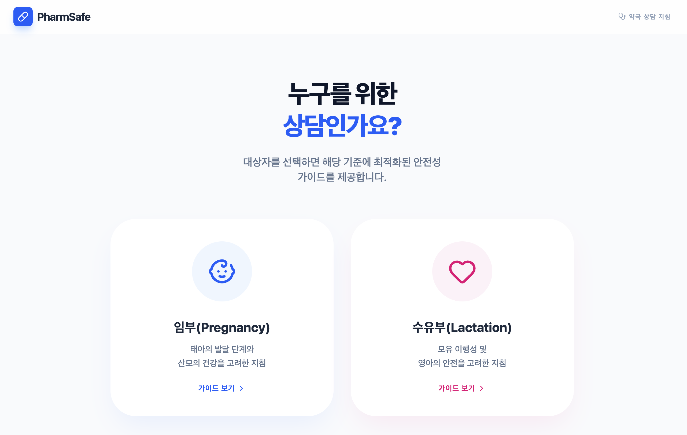

# PharmSafe

임신/수유 중 의약품 안전 정보를 빠르게 조회할 수 있도록 만든 React + Vite 기반 웹 앱입니다.

- 서비스 URL: https://pharmsafe.vercel.app

[](./LICENSE)
[](https://pharmsafe.vercel.app)
[](https://vercel.com/new/clone?repository-url=https://github.com/goneyak/pharmsafe)
[](https://app.netlify.com/start/deploy?repository=https://github.com/goneyak/pharmsafe)

## 스크린샷

아래 경로에 스크린샷 파일을 넣으면 README에서 바로 표시됩니다.

- 권장 파일: `docs/screenshot-main.png`
- 권장 해상도: 가로 1440px 이상
- 템플릿 파일: `docs/screenshot-main-template.svg`
- 사용 방법: 템플릿을 Figma/Illustrator/브라우저에서 열어 내용 교체 -> PNG로 내보내기(파일명 `screenshot-main.png`)



## 주요 기능

- 의약품명/카테고리 검색
- 임신 중 안전도 분류 (`safe`, `caution`, `avoid`)
- 수유 중 안전도 분류 (`safe`, `caution`, `avoid`)
- 약물별 상세 설명 및 대표 제품명(브랜드) 확인

## 기술 스택

- React 19
- TypeScript
- Vite
- lucide-react
- motion

## 시작하기

### 요구 사항

- Node.js 18 이상
- npm

### 설치 및 실행

```bash
npm install
npm run dev
```

브라우저에서 `http://localhost:3000`으로 접속합니다.

### 빌드

```bash
npm run build
```

### 타입 체크

```bash
npm run lint
```

## 프로젝트 구조

```text
pharmsafe/
├── src/
│   ├── App.tsx
│   ├── main.tsx
│   └── index.css
├── package.json
├── tsconfig.json
└── vite.config.ts
```

## 데이터 안내

- 앱에 포함된 약물 정보는 코드 내 정적 데이터로 관리됩니다.
- 데이터는 최신 임상 가이드/식약처 고시 개정에 따라 주기적 업데이트가 필요합니다.

## 의료 정보 관련 고지

이 프로젝트는 정보 제공 목적이며, 의료진의 진료 및 처방을 대체하지 않습니다.
임신/수유 중 약물 복용 여부는 반드시 의사 또는 약사와 상담 후 결정하세요.

## GitHub 업로드

아래 명령으로 로컬 프로젝트를 원격 저장소에 업로드할 수 있습니다.

```bash
git init
git add .
git commit -m "Initial commit: PharmSafe"
git branch -M main
git remote add origin <YOUR_GITHUB_REPO_URL>
git push -u origin main
```

`<YOUR_GITHUB_REPO_URL>` 예시:

- `https://github.com/<username>/pharmsafe.git`
- `git@github.com:<username>/pharmsafe.git`

## GitHub 저장소 정보 세팅 (Topics / About / 홈페이지)

### 1) 웹에서 직접 설정

1. 저장소 상단의 톱니바퀴 아이콘(Edit repository details) 클릭
2. **Description(About)** 입력
3. **Website**에 배포 URL 입력 (예: Vercel/Netlify URL)
4. **Topics**에 태그 추가 후 저장

추천 Description 예시:

```text
Medication safety lookup for pregnancy and lactation (Korean)
```

추천 Topics:

```text
pharmacy, medication-safety, pregnancy, lactation, react, vite, typescript, healthcare
```

### 2) CLI로 설정 (`gh`)

```bash
# About(설명), 홈페이지 링크 설정
gh repo edit goneyak/pharmsafe \
	--description "Medication safety lookup for pregnancy and lactation (Korean)" \
	--homepage "https://pharmsafe.vercel.app"

# Topics 추가
gh repo edit goneyak/pharmsafe \
	--add-topic pharmacy \
	--add-topic medication-safety \
	--add-topic pregnancy \
	--add-topic lactation \
	--add-topic react \
	--add-topic vite \
	--add-topic typescript \
	--add-topic healthcare
```

## 배포 가이드

### Vercel

1. Vercel에서 `New Project` 선택
2. `goneyak/pharmsafe` 저장소 Import
3. Framework preset은 `Vite` 유지
4. Build Command: `npm run build`
5. Output Directory: `dist`
6. Deploy

### Netlify

1. Netlify에서 `Add new site` -> `Import an existing project`
2. `goneyak/pharmsafe` 저장소 선택
3. Build command: `npm run build`
4. Publish directory: `dist`
5. Deploy

## 라이선스

이 프로젝트는 [MIT License](./LICENSE)를 따릅니다.
