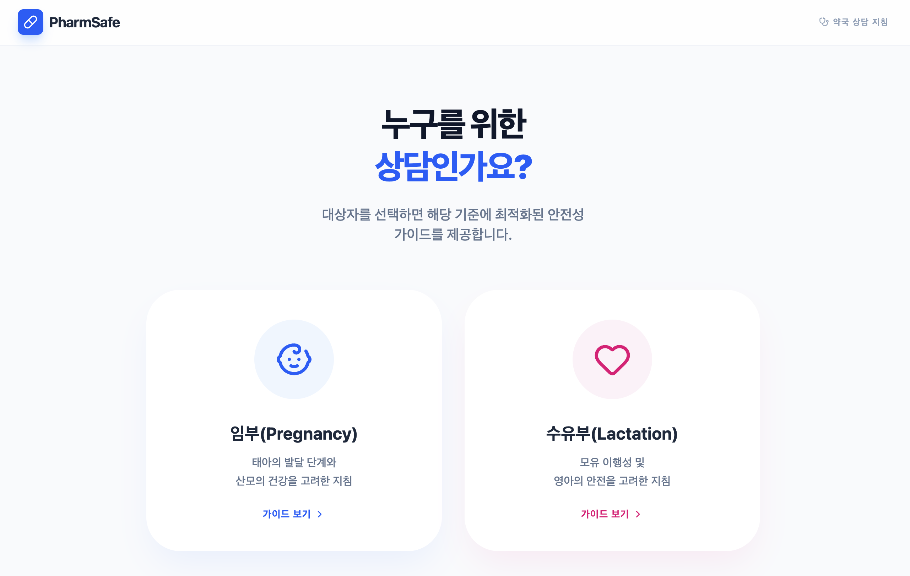
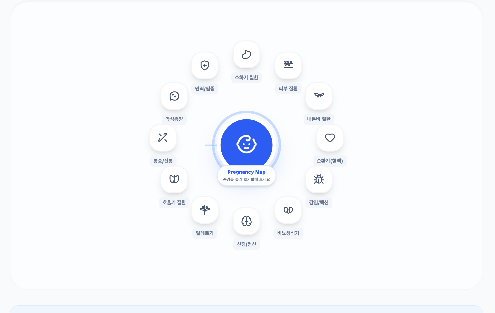

# PharmSafe

PharmSafe는 약국 현장에서 임부 의약품 상담 시 빠르게 참고할 수 있도록 만든 약물 안전성 lookup MVP입니다.

현재 공개 버전은 2025년 식품의약품안전처(MFDS) 전문가용 참고자료를 바탕으로, 임부 약물 정보를 검색 가능한 카드와 증상/질환 중심 탐색 UI로 재구성합니다. 이 도구는 약사의 전문적 판단을 보조하기 위한 참고 자료이며, 진단, 처방, 공식 의약품 정보 데이터베이스를 대체하지 않습니다.

Live app: https://pharmsafe.vercel.app

## Demo





## Product Positioning

- Pharmacist-facing medication safety lookup MVP
- Optimized for quick counselling in community pharmacy workflows
- Focused on pregnancy counselling in the current public release
- Lactation-specific content is being reviewed before full release

## Current Scope

Implemented:
- Pregnancy medication safety lookup
- Category and keyword-based search
- Searchable drug cards with short counselling notes
- Pregnancy symptom/category map view
- MFDS 2025-based summary guidance

In progress:
- Lactation-specific public release
- Source-level citation fields by record
- More explicit update/version tracking for clinical content

## Clinical Positioning

PharmSafe는 임부 의약품 안전성 정보를 `우선 고려 / 신중 사용 / 회피 권고` 형태로 빠르게 탐색할 수 있게 정리한 참고 도구입니다. 실제 상담에서는 임신 주수, 수유 여부, 용량, 투여 기간, 투여 경로, 기저질환, 병용약물을 함께 고려해야 하므로 본 앱의 라벨만으로 최종 의사결정을 내려서는 안 됩니다.

## Source Method

- Primary reference: MFDS, `임부에 대한 의약품 적정사용 정보집 (전문가용)`, 2025
- Drug cards were manually reorganized into structured counselling summaries
- The repository does not claim to reproduce the full source document as an official database

원문 파일과 작업 메모는 [`references/`](references) 및 [`scripts/`](scripts) 아래로 정리했습니다.

## Privacy and Analytics

- This app does not collect personal health information
- Vercel Analytics is used only for aggregate traffic monitoring such as page views and general usage trends

## Tech Stack

- React 19
- TypeScript
- Vite 8
- Tailwind CSS 4
- Lucide React
- Motion
- Vercel Analytics

## Local Development

```bash
git clone https://github.com/goneyak/pharmsafe.git
cd pharmsafe
npm install
npm run dev
```

Open `http://localhost:3000`.

## Project Structure

```text
pharmsafe/
├── .github/workflows/ # CI - typecheck, data validation, build
├── docs/              # screenshots and visual assets
├── references/        # source-reference notes
├── scripts/
│   ├── validate-data.ts   # data integrity check (npm test)
│   └── ...                # one-off data transformation scripts
├── src/
│   ├── data/
│   │   ├── medications.ts             # 의약품 데이터 정본
│   │   ├── medications.lactation.ts   # 수유부 초안 - 앱에서 import 하지 않는다
│   │   └── categories.ts              # 카테고리 분류 체계
│   └── App.tsx        # UI
├── LICENSE
├── package.json
└── README.md
```

## Data Integrity

`npm test` (`scripts/validate-data.ts`) runs in CI and fails the build on:

- duplicate record ids
- missing required fields
- invalid safety enum values
- records whose category is unreachable from the UI
- the same ingredient carrying different safety labels without `indication` / `formulation` / `doseNote` to distinguish them
- `App.tsx` importing the unreleased lactation draft

It also reports source-citation coverage on every run.

## Known Limitations

- **Source citations cover 64/236 records (27%).** Records without a `source` field render an explicit
  "원문 출처 미확인" warning on the card. 9 records reference ingredients that do not appear anywhere in
  the cited MFDS document at all and need to be re-sourced or removed.
- **Safety labels have not been reconciled with the MFDS 국내 허가사항 field.** A cross-check found 46 of
  132 comparable records where the app label differs from the permit label - most often because the source
  splits its judgement by formulation or dose (e.g. cetirizine tablet vs oral solution, pyridoxine 50mg vs
  300mg) while the record carries a single label. The `formulation`, `doseNote`, and `permitLabel` fields
  exist for this but are not yet populated.
- **`permitLabel` and `pregnancySafety` are deliberately separate.** Some drugs are contraindicated on the
  Korean permit label yet recommended first-line clinically (e.g. nifedipine in pregnancy hypertension).
  Pharmacists need to know when a recommendation is off-label; collapsing the two loses that.
- Lactation content is not yet released. Its draft data lives in `src/data/medications.lactation.ts` and is
  **not imported by the app**, so it is not shipped in the client bundle.

## License

This project is licensed under the MIT License. See [LICENSE](LICENSE).
